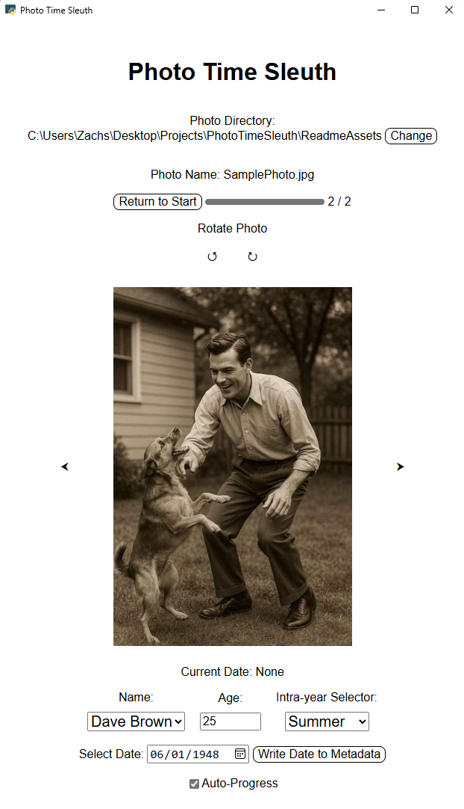

# Photo Time Sleuth

Photo Time Sleuth is a Python-based desktop application that helps users correct photo timestamps using visual and contextual clues such as seasons, birthdays, and estimated ages.


## Features

* View and navigate photos in a selected directory
* Use modular tools to refine estimated photo dates
* Apply timestamp corrections directly to metadata
* Locally hosted for secure, offline use

## Installation

### Requirements

* Python 3.12+ (Other versions may work, but are untested)
* [uv](https://docs.astral.sh/uv/)
* Windows (other platforms may work, but are untested)

### Clone the Repository

```bash
git clone https://github.com/RTnhN/PhotoTimeSleuth.git
cd PhotoTimeSleuth
```

### Install Dependencies

Using uv:

```bash
uv sync
```

## Usage

Run the app with a specified photo directory:

```bash
uv run python ./PhotoTimeSleuth/app.py 
```

A browser window will open with the interactive interface.


You then can select a directory that you want to correct the timestamps of your photos. This will load the photos into the interface. For each photo, you can either directly give the date or you can select a person from the dropdown menu, give their age, and select the intra-year season.



Intra-year seasons are based on the closest season to the birthday of the person. Right now, I have the following intra-year "seasons":

* Spring
* Summer
* Fall
* Winter
* Birthday
* Christmas

I selected these seasons because they are the most common seasons for people to take photos. Let me know if you have any suggestions.

## Configuration

* `default_bday.txt`: Add known birthdays (format: `name--tab-->YYYY-MM-DD`) to improve age-based estimates.


## Packaging

To create a standalone executable:

```bash
pyinstaller PhotoTimeSleuth.spec
```
## License

MIT License. See [LICENSE](LICENSE) for details.

## Contributing

Pull requests are welcome. Please fork the repository and submit changes via a feature branch.

## Disclaimer

Photo metadata changes are irreversible. Always back up original files before running this tool. Maybe in the future I will add a revert function.


